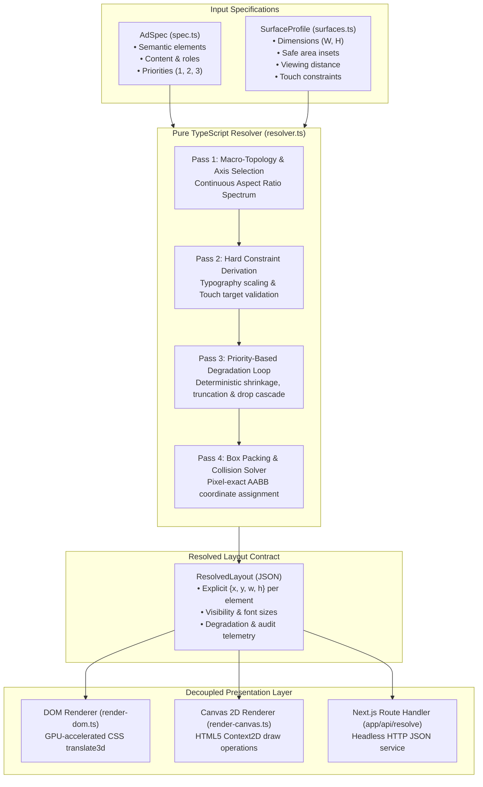
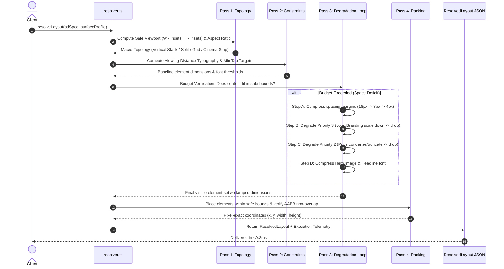
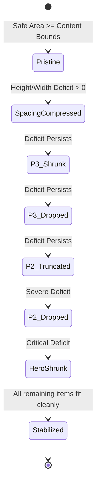

# System Architecture: Adaptive Layout Engine

This document provides a deep architectural walkthrough of the **Adaptive Layout Engine for Multi-Surface Ads**, detailing the design principles, data flow pipelines, component isolation guarantees, and the mathematical constraint-resolution passes.

---

## 1. High-Level Architecture Pipeline

The system is strictly architected around a unidirectional data flow. The layout engine is **completely decoupled** from UI frameworks, CSS media queries, and rendering backends.



---

## 2. Component Separation & Decoupling Guarantees

| Component | File Path | Responsibilities | Dependencies |
| :--- | :--- | :--- | :--- |
| **Ad Spec Definition** | `src/spec.ts` | Strongly-typed builders, role definitions, and compile-time/runtime validation for elements. | Pure TypeScript (Zero external deps) |
| **Surface Profiles** | `src/surfaces.ts` | Physical display specifications: safe area margins, touch requirements, minimum tap targets, and viewing distance tiers. | Pure TypeScript |
| **Constraint Resolver** | `src/resolver.ts` | Algorithmic multi-pass solver: topology selection, constraint enforcement, greedy budget degradation, and coordinate packing. | Pure TypeScript (No DOM, no React, no CSS) |
| **DOM Renderer** | `src/render-dom.ts` | Maps resolved coordinates to absolute DOM nodes with hardware-accelerated animations and accessibility guidelines. | DOM API / React Virtual DOM |
| **Canvas Renderer** | `src/render-canvas.ts` | Alternative rendering backend proving engine portability; renders the exact same JSON onto HTML5 Canvas 2D. | HTML5 Canvas Context2D |
| **REST API Handler** | `app/api/resolve/route.ts` | Exposes the resolver as a serverless microservice over HTTP POST. | Next.js Server Runtime |
| **Interactive Dashboard** | `app/page.tsx` | Visual lab for real-time surface switching, live space degradation, and diagnostics inspection. | React, Next.js, Lucide Icons |

---

## 3. Four-Pass Algorithmic Constraint Solving

The resolver **never uses per-surface hardcoded switch statements** (e.g., `if (surface.name === 'mobile')`). Instead, it treats the surface as a continuous geometric and physiological problem.



### Pass 1: Continuous Aspect-Ratio Classification
The macro-topology is determined strictly from the computed safe viewport aspect ratio ($AR = \frac{W_{\text{safe}}}{H_{\text{safe}}}$):

1. **Ultra-Wide Ribbon ($AR \ge 3.0$):** `cinema-wide-strip`
   - Content flows horizontally from left to right.
   - Elements are vertically centered within the banner.
2. **Landscape Viewport ($1.4 \le AR < 3.0$):** `horizontal-split`
   - Dual-column topology: 45% media column for the Hero, 55% copy column for Headline, Price, and CTA.
3. **Equi-dimensional / Square ($0.85 \le AR < 1.4$):** `multi-column-grid`
   - Balanced spatial quadrant model balancing large touch targets for public kiosks.
4. **Tall / Portrait ($AR < 0.85$):** `vertical-stack`
   - Vertical flow optimized for single-hand mobile ergonomics (CTA placed in bottom thumb zone).

---

### Pass 2: Physiological & Hardware Constraints
- **Viewing Distance:**
  - `far` ($>3\text{m}$, e.g., Broadcast / Billboards): Multiplies base typography by $2.2\times$ and enforces a strict lower floor of $\ge 32\text{px}$ so viewers across a room can read text.
  - `medium` ($\sim 1\text{m}$, e.g., Kiosk): Multiplies typography by $1.35\times$.
  - `near` ($\sim 30\text{cm}$, e.g., Mobile / Watch): Standard baseline ($1.0\times$).
- **Touch Targets:**
  - If `touchOnly === true`, interactive buttons enforce a minimum physical height (e.g., $44\text{px}$ for Apple HIG, $60\text{px}$ for standing kiosks).

---

### Pass 3: Priority-Ordered Degradation State Machine

When available safe area dimensions are insufficient, the engine executes a deterministic relaxation cascade. Critical content (Headline, Hero, Action CTA) is preserved at all costs.



---

### Pass 4: Box Packing & Collision Prevention
- Coordinates are computed relative to $(0, 0)$ of the surface container.
- Safe area offsets are added to guarantee insets clearance (e.g. camera notches, bezel safe zones).
- An Axis-Aligned Bounding Box (AABB) intersection check is executed across all visible elements:
  $$\text{Collision}(A, B) \iff (A_x < B_x + B_w) \land (A_x + A_w > B_x) \land (A_y < B_y + B_h) \land (A_y + A_h > B_y)$$
- Guarantees $0$ collisions under every tested configuration.

---

## 4. Renderer Portability Test (DOM vs Canvas)

Because the resolver outputs pure geometric primitives, replacing or augmenting the renderer requires **zero changes** to the resolver:

```
ResolvedLayout JSON
      ├──> render-dom.ts    -> HTML <div>, , <button> (DOM Node Tree)
      ├──> render-canvas.ts -> CanvasRenderingContext2D (Native Canvas Pixels)
      └──> Headless PDF     -> Future PDF export pipeline
```
